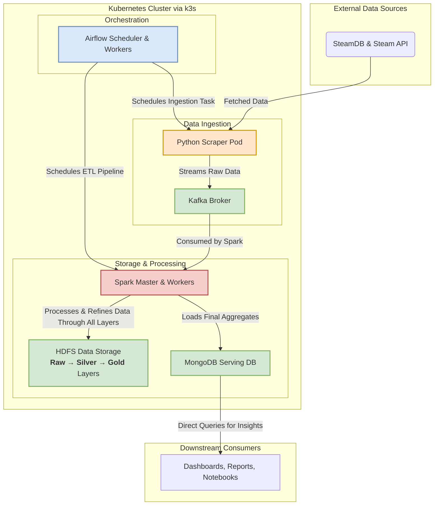

# Big Data Pipeline for Steam Game Analysis

This project implements a distributed pipeline for scraping, processing, and analyzing game data from Steam and SteamDB. The project use Kubernetes (specifically k3s) running on a cluster of 3 to 5 laptops connected via a virtual private network.

## Architecture

The architecture use Airflow acts as the central orchestrator, scheduling tasks that leverage Kafka for data streaming, Spark for distributed processing, and HDFS and MongoDB for storage.



## Tech Stack

- **Operating System**: Ubuntu-22.04 on WSL2 on Windows
- **Container Runtime**: `containerd` (packaged with k3s)
- **Networking**: Tailscale (for static IP for each laptop)
- **Kubernetes Distribution**: k3s
- **Application Deployment**: Helm
- **Orchestrator**: Apache Airflow
- **Processing Engine**: Apache Spark
- **Streaming/Messaging**: Apache Kafka
- **Distributed Storage**: HDFS
- **NoSQL Database**: MongoDB

---

## Starting guide for project members

This guide details the steps to create a n-node Kubernetes cluster across n laptops and deploy the big data stack. One laptop will be selected as the k3s server node, and other laptops as agent node.

### Step 1: Prerequisites (All Laptops)

1.  **Install WSL2**: Follow the guide on official Microsoft page

2.  **Install Tailscale**:

    - **On WSL2 (Ubuntu Terminal)**: Run the following to install and start Tailscale.
      ```bash
      curl -fsSL https://tailscale.com/install.sh | sh
      sudo tailscale up
      # Add each laptops to tailnet, detail in group mess
      ```

3.  **Share IP Addresses**: Each member must find their Tailscale IP address and share it with the team.
    ```bash
    tailscale ip -4
    ```

### Step 2: Cluster Formation (k3s)

Designate one member as the **Server Node** and the others as **Agent Nodes**.

#### On the Server Node ONLY

Run these commands in your WSL2 terminal.

```bash
# 1. Generate and share a secret token for the cluster
export K3S_TOKEN=$(openssl rand -hex 16)
# Note down and share with others

# 2. Get your own Tailscale IP
export SERVER_IP=$(tailscale ip -4)
echo "server IP: ${SERVER_IP}"

# 3. Install k3s server with permissions for the config file
curl -sfL https://get.k3s.io | K3S_TOKEN=${K3S_TOKEN} INSTALL_K3S_EXEC="server --node-ip=${SERVER_IP} --flannel-iface=tailscale0 --write-kubeconfig-mode 644" sh -
```

After k3s is install:

```bash
# 4. Configure kubectl for your user
mkdir -p ~/.kube
cp /etc/rancher/k3s/k3s.yaml ~/.kube/config
sed -i "s/127.0.0.1/${SERVER_IP}/" ~/.kube/config
echo "kubectl is now configured."
```

#### On the 4 Agent Nodes ONLY

Each of the other four students must run these commands in their WSL2 terminal.

```bash
# 1. Set environment variables
#    PASTE the token and server IP shared by the Server Node member
export K3S_TOKEN="<PASTE_THE_SHARED_TOKEN_HERE>"
export SERVER_IP="<PASTE_SERVER_TAILSCALE_IP_HERE>"
export MY_IP=$(tailscale ip -4)

# 2. Install k3s agent
curl -sfL https://get.k3s.io | K3S_URL="https://"${SERVER_IP}":6443" K3S_TOKEN="${K3S_TOKEN}" INSTALL_K3S_EXEC="agent --node-ip=${MY_IP}" sh -

echo "Agent installation complete."
```

### Step 3: Configuration Files

Clone the repo, it should contain all config files (yaml files)

### Step 4: Deploying the Application Stack

On the **Server Node**, run these commands to install everything.

Install Helm

```bash
curl -fsSL -o get_helm.sh https://raw.githubusercontent.com/helm/helm/main/scripts/get-helm-3
chmod 700 get_helm.sh
./get_helm.sh
```

Add necessary helm repos

```bash
helm repo add bitnami https://charts.bitnami.com/bitnami
helm repo add apache-airflow https://airflow.apache.org
helm repo update
```

Deploy the applications

```bash
helm install mongodb bitnami/mongodb --values mongodb-values.yaml
helm install kafka bitnami/kafka --values kafka-values.yaml
helm install spark bitnami/spark --values spark-values.yaml
helm install airflow apache-airflow/airflow --namespace airflow --create-namespace --values airflow-values.yaml
```
