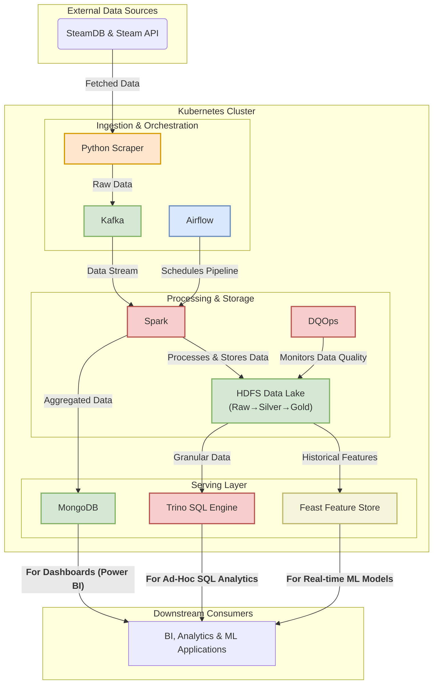

# Big Data Pipeline for Steam Game Analysis

This project implements a distributed pipeline for scraping, processing, and analyzing game data from Steam and SteamDB. The project use Kubernetes (specifically k3s) running on a cluster of 3 to 5 laptops connected via a virtual private network.

Note: the new data is located at [data](https://www.mediafire.com/file/l6xvh74100enjhz/data_mining.rar/file)

## Architecture

The architecture uses Airflow as the central orchestrator, scheduling tasks that leverage Kafka for data streaming, Spark for distributed processing, and HDFS and MongoDB for storage.



## Tech Stack

- **Operating System**: Ubuntu-22.04 on WSL2 on Windows
- **Container Runtime**: `containerd` (packaged with k3s)
- **Networking**: Tailscale (for static IP for each laptop)
- **Kubernetes Distribution**: k3s
- **Application Deployment**: Helm
- **Orchestrator**: Apache Airflow
- **Processing Engine**: Apache Spark
- **Streaming/Messaging**: Apache Kafka
- **Distributed Storage**: HDFS
- **NoSQL Database**: MongoDB
- **Query Engine**: Trino
- **Data Quality**: DQOps
- **Feature Store**: Feast

---

## Starting guide for project members

This guide details the steps to create an n-node Kubernetes cluster across n laptops and deploy the big data stack. One laptop will be selected as the K3s server node, and the other laptops as agent nodes.

### Step 1: Prerequisites (All Laptops)

1.  **Install WSL2**: Follow the guide on the official Microsoft page

2.  **Install Tailscale**:

    - **On WSL2 (Ubuntu Terminal)**: Run the following to install and start Tailscale.

      ```bash
      curl -fsSL https://tailscale.com/install.sh | sh
      sudo tailscale up

      # On first install, there will be a link. Send it to Discord so I can add you to Tailnet
      ```

3.  **Share IP Addresses**: Each member must find their Tailscale IP address and share it with the team.
    ```bash
    tailscale ip -4
    # Share the ip on Discord
    ```

### Step 2: Cluster Formation (k3s)

Designate one member as the **Server Node** and the others as **Agent Nodes**.

#### On the Server Node ONLY

Run these commands in your WSL2 terminal.

0. Get the token

```
openssl rand -hex 16
# Copy the result
```

1. Edit the .bashrc file

```
nano ~/.bashrc
# or
vim ~/.bashrc
```

2. Paste the following into the .bashrc file

```bash
export K3S_TOKEN="THE HEX RESULT COPIED IN STEP 0"
export SERVER_IP=$(tailscale ip -4)
export TAILSCALE_AUTH_KEY="THE TAILSCALE AUTH KEY"
```

3. Install k3s server with permissions for the config file

```
source ~/.bashrc
export INSTALL_K3S_EXEC="server --token=${K3S_TOKEN} --vpn-auth=name=tailscale,joinKey=${TAILSCALE_AUTH_KEY} --node-external-ip=${SERVER_IP}"
curl -sfL https://get.k3s.io | sh -
```

After k3s is install:

```bash
# 4. Configure kubectl for your user
mkdir -p ~/.kube
cp /etc/rancher/k3s/k3s.yaml ~/.kube/config
sed -i "s/127.0.0.1/${SERVER_IP}/" ~/.kube/config
echo "kubectl is now configured."
```

#### On the 4 Agent Nodes ONLY

Each of the other four students must run these commands in their WSL2 terminal.

1. Edit the .bashrc

```
nano ~/.bashrc
# or
vim ~/.bashrc
```

2. Paste the env variables got from the server node into .bashrc

```bash
# 1. Set environment variables
#  Get the env from Discord!!!
export K3S_TOKEN="<PASTE_THE_SHARED_TOKEN_HERE>"
export SERVER_IP="<PASTE_SERVER_TAILSCALE_IP_HERE>"
export TAILSCALE_AUTH_KEY="<PASTE_TAILSCALE_AUTH_KEY_HERE>"
export K3S_URL="https://${SERVER_IP}:6443"
export AGENT_IP=$(tailscale ip -4)
```

3. Install k3s agent

```
export INSTALL_K3S_EXEC="agent --vpn-auth=name=tailscale,joinKey=${TAILSCALE_AUTH_KEY} --node-external-ip=${AGENT_IP} --server=${K3S_URL} --token=${K3S_TOKEN}"
curl -sfL https://get.k3s.io | sh -
```

4. Configure the k3s agent to be able to use kubectl

Download the `k3s.yaml` file on Discord and put it into the `~/.kube/` folder as the file `config`:

```bash
mkdir -p $HOME/.kube
cp k3s.yaml ~/.kube/config
```

### Step 3: Configuration Files

Clone the repo, it should contain all config files (yaml files)

### Step 4: Deploying the Application Stack

On the **Server Node**, run these commands to install everything.

Install Helm

```bash
curl -fsSL -o get_helm.sh https://raw.githubusercontent.com/helm/helm/main/scripts/get-helm-3
chmod 700 get_helm.sh
./get_helm.sh
```

Add necessary helm repos

```bash
helm repo add bitnami https://charts.bitnami.com/bitnami
helm repo add airflow-community https://airflow-helm.github.io/charts
helm repo add spark-operator https://kubeflow.github.io/spark-operator
helm repo add pfisterer https://pfisterer.github.io/apache-hadoop-helm/
helm repo update
```

Deploy the applications

```bash
helm install mongodb bitnami/mongodb --values mongodb-values.yaml
helm install kafka bitnami/kafka --values kafka-values.yaml
helm install airflow airflow-community/airflow --namespace airflow -f airflow-values-lite.yaml
helm install spark-operator spark-operator/spark-operator --namespace spark-operator --set sparkJobNamespace="" --set webhook.enable=true
helm install my-hadoop pfisterer/hadoop   --namespace hadoop   -f hdfs_values.yaml
# Provide the same function as hadoop, but easier to use, for dev prupose only
helm install minio bitnami/minio   --namespace airflow   --values minio_values.yaml
```

### Side notes

How to use Spark: [Spark guide](SPARK.md)

### Some useful commands

1. Get all nodes

```bash
k3s kubectl get nodes -o wide
```

2. Get all pods

```bash
k3s kubectl get pods -o wide -n <namespace>
```

3. Get detailed node information

```bash
k3s kubectl describe nodes
```

4. Get pod details

```bash
kubectl describe pod <pod-name> -n <namespace>
```

5. Get pod logs

```bash
kubectl logs -f <pod-name> -n <namespace>
```

6. Get previous pod logs (useful for debug/crash)

```bash
kubectl logs -f <pod-name> -n <namespace> --previous
```

7. Execute the command in the pod

```bash
kubectl exec -it <pod-name> -n <namespace> -- /bin/bash
```

8. Uninstall k3s

Server node:

```bash
/usr/local/bin/k3s-uninstall.sh
sudo rm -rf /etc/rancher/ /var/lib/rancher/
```

Agent node:

```bash
/usr/local/bin/k3s-agent-uninstall.sh
sudo rm -rf /etc/rancher/ /var/lib/rancher/
```
