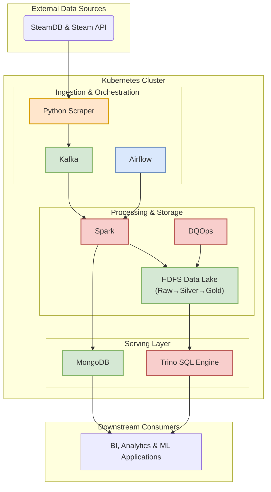

# Steam Game Analytics Pipeline

<div align="center">

**A distributed big data pipeline for real-time Steam game analytics**

[](https://k3s.io/)
[](https://spark.apache.org/)
[](https://kafka.apache.org/)

</div>

---

## 📖 Overview

This project implements a **distributed data pipeline** for scraping, processing, and analyzing game data from Steam and SteamDB. Built on a **Kubernetes cluster** spanning 3-5 laptops connected via Tailscale VPN, it demonstrates real-world big data engineering practices including:

- **Kappa Architecture** with Kafka as the central event log
- **Medallion Architecture** (Raw → Silver → Gold) for data lakehouse design
- **Real-time streaming** with Spark Structured Streaming
- **Data quality monitoring** with PyDeequ
- **Multiple serving layers** for BI, SQL analytics, and ML

> 📦 **Sample Data**: Download pre-scraped data from [MediaFire](https://www.mediafire.com/file/4hik88ybarvtekf/new_new_data.rar/file)

---

## 🏗️ Architecture


```mermaid
flowchart TD
    subgraph A["External Data Sources"]
        Sources("SteamDB & Steam API")
    end

    subgraph B["Kubernetes Cluster"]
        direction LR
        subgraph B1["Ingestion & Orchestration"]
            Airflow["Airflow"]:::orchestration
            Scraper["Python Scraper"]:::ingestion
            Kafka["Kafka"]:::storage
        end

        subgraph B2["Processing & Storage"]
            Spark["Spark"]:::processing
            HDFS["HDFS Data Lake<br>(Raw→Silver→Gold)"]:::storage
            DQOps["DQOps"]:::processing
        end

        subgraph B3["Serving Layer"]
            MongoDB["MongoDB"]:::storage
            Trino["Trino SQL Engine"]:::processing
        end
    end

    subgraph C["Downstream Consumers"]
        Consumers["BI, Analytics & ML Applications"]
    end

    Sources --> Scraper --> Kafka --> Spark --> HDFS
    DQOps --> HDFS
    Airflow --> Spark
    Spark --> MongoDB --> Consumers
    HDFS --> Trino --> Consumers

    classDef storage fill:#D5E8D4,stroke:#82B366,stroke-width:2px
    classDef processing fill:#F8CECC,stroke:#B85450,stroke-width:2px
    classDef orchestration fill:#DAE8FC,stroke:#6C8EBF,stroke-width:2px
    classDef ingestion fill:#FFE6CC,stroke:#D79B00,stroke-width:2px
```

---

## 🛠️ Tech Stack

| Category           | Technology                              |
| ------------------ | --------------------------------------- |
| **Infrastructure** | Ubuntu 22.04 (WSL2), k3s, Tailscale VPN |
| **Orchestration**  | Apache Airflow, Helm                    |
| **Streaming**      | Apache Kafka (Strimzi Operator)         |
| **Processing**     | Apache Spark (Spark Operator)           |
| **Storage**        | HDFS, Apache Iceberg, MongoDB           |
| **Query Engine**   | Trino, Nessie Catalog                   |
| **Data Quality**   | PyDeequ                                 |

---

## 📁 Project Structure

```
├── deploy/                    # Kubernetes deployment configs
│   ├── helm/                  # Helm value files
│   ├── kafka/                 # Kafka cluster & topic manifests
│   ├── producers/             # Producer deployment YAMLs
│   └── spark/                 # SparkApplication manifests
│
├── src/                       # Application source code
│   ├── producers/             # Kafka producer microservices
│   │   ├── game_catalog/      # Game metadata producer
│   │   ├── live_review/       # Live review stream producer
│   │   └── player_count/      # Player count producer
│   └── spark/                 # Spark processing jobs
│       ├── silver/            # Raw → Silver transformations
│       ├── gold/              # Silver → Gold aggregations
│       └── data_quality/      # DQ validation jobs
│
├── scripts/                   # Utilities & operations
│   ├── bootstrap/             # Data bootstrap scripts
│   ├── scrapers/              # Web scraping tools
│   ├── utilities/             # Data utilities
│   └── ops/                   # Operational scripts
│
└── data/                      # Local data directory (gitignored)
    ├── cache/                 # API response caches
    ├── raw/                   # Scraped datasets
    └── state/                 # Scraper state files
```

---

## 🚀 Quick Start

### Prerequisites

- **WSL2** with Ubuntu 22.04
- **Tailscale** account and VPN setup
- **Docker** for building images
- **Python 3.9+** for running scripts locally

### Step 1: Cluster Setup

<details>
<summary><b>Server Node Setup</b></summary>

```bash
# Generate a cluster token
openssl rand -hex 16  # Save this token

# Add to ~/.bashrc
export K3S_TOKEN="<YOUR_TOKEN>"
export SERVER_IP=$(tailscale ip -4)
export TAILSCALE_AUTH_KEY="<YOUR_TAILSCALE_KEY>"

# Install k3s server
source ~/.bashrc
export INSTALL_K3S_EXEC="server --token=${K3S_TOKEN} --vpn-auth=name=tailscale,joinKey=${TAILSCALE_AUTH_KEY} --node-external-ip=${SERVER_IP}"
curl -sfL https://get.k3s.io | sh -

# Configure kubectl
mkdir -p ~/.kube
cp /etc/rancher/k3s/k3s.yaml ~/.kube/config
sed -i "s/127.0.0.1/${SERVER_IP}/" ~/.kube/config
```

</details>

<details>
<summary><b>Agent Node Setup</b></summary>

```bash
# Get credentials from server node admin
export K3S_TOKEN="<SHARED_TOKEN>"
export SERVER_IP="<SERVER_TAILSCALE_IP>"
export TAILSCALE_AUTH_KEY="<SHARED_TAILSCALE_KEY>"
export K3S_URL="https://${SERVER_IP}:6443"
export AGENT_IP=$(tailscale ip -4)

# Install k3s agent
export INSTALL_K3S_EXEC="agent --vpn-auth=name=tailscale,joinKey=${TAILSCALE_AUTH_KEY} --node-external-ip=${AGENT_IP} --server=${K3S_URL} --token=${K3S_TOKEN}"
curl -sfL https://get.k3s.io | sh -

# Copy kubeconfig from server
mkdir -p ~/.kube
# Place the k3s.yaml file from server into ~/.kube/config
```

</details>

### Step 2: Deploy Infrastructure

```bash
# Install Helm
curl -fsSL https://raw.githubusercontent.com/helm/helm/main/scripts/get-helm-3 | bash

# Add Helm repositories
helm repo add bitnami https://charts.bitnami.com/bitnami
helm repo add airflow-community https://airflow-helm.github.io/charts
helm repo add spark-operator https://kubeflow.github.io/spark-operator
helm repo add pfisterer https://pfisterer.github.io/apache-hadoop-helm/
helm repo add nessie-helm https://charts.projectnessie.org
helm repo add strimzi https://strimzi.io/charts/
helm repo update

# Deploy core services
helm install my-mongodb bitnami/mongodb -n database --create-namespace -f deploy/helm/mongodb-values.yaml
helm install my-hadoop pfisterer/hadoop -n hadoop --create-namespace -f deploy/helm/hdfs_values.yaml
helm install spark-operator spark-operator/spark-operator -n spark-operator --create-namespace --set webhook.enable=true
helm install strimzi-kafka-operator strimzi/strimzi-kafka-operator -n strimzi --create-namespace

# Deploy Kafka cluster
kubectl create namespace kafka
kubectl apply -f deploy/kafka/kafka-cluster.yaml -n kafka
kubectl apply -f deploy/kafka/kafka-topics.yaml -n kafka

# Deploy Redis
helm install redis bitnami/redis -n redis --create-namespace \
  --set image.repository=bitnamilegacy/redis \
  --set image.tag=8.2-debian-12 \
  --set architecture=standalone
```

### Step 3: Configure Secrets

```bash
# Get Redis password
export REDIS_PASS=$(kubectl get secret -n redis redis -o jsonpath="{.data.redis-password}" | base64 -d)

# Create secrets
kubectl create secret generic steam-api-secrets --from-literal=api-key=<YOUR_STEAM_API_KEY>
kubectl create secret generic redis-secret --from-literal=password=$REDIS_PASS
```

### Step 4: Bootstrap Data

```bash
# Port-forward Redis for local access
kubectl port-forward redis-master-0 6379:6379 -n redis &

# Run bootstrap scripts (from repo root)
python scripts/bootstrap/bootstrap_redis.py
python scripts/bootstrap/bootstrap_data.py
```

### Step 5: Deploy Producers

```bash
kubectl apply -f deploy/producers/deploy-game-catalog-producer.yaml
kubectl apply -f deploy/producers/deploy-live-review-producer.yaml
kubectl apply -f deploy/producers/deploy-player-count-producer.yaml

# Verify deployment
kubectl get pods -l app=game-catalog-producer
kubectl get pods -l app=live-review-producer
kubectl get pods -l app=player-count-producer
```

---

## 📊 Running Spark Jobs

See [SPARK.md](SPARK.md) for detailed instructions on submitting Spark jobs.

```bash
# Example: Run the game catalog cleaning job
kubectl apply -f deploy/spark/game.yaml

# Check job status
kubectl get sparkapplications
kubectl logs -f spark-game-driver
```

---

## 📚 Useful Commands

<details>
<summary><b>Kubernetes Commands</b></summary>

| Command                                       | Description            |
| --------------------------------------------- | ---------------------- |
| `kubectl get nodes -o wide`                   | List all cluster nodes |
| `kubectl get pods -n <namespace>`             | List pods in namespace |
| `kubectl describe pod <pod> -n <ns>`          | Get pod details        |
| `kubectl logs -f <pod> -n <ns>`               | Stream pod logs        |
| `kubectl logs <pod> -n <ns> --previous`       | Get previous pod logs  |
| `kubectl exec -it <pod> -n <ns> -- /bin/bash` | Shell into pod         |

</details>

<details>
<summary><b>Uninstall k3s</b></summary>

**Server Node:**

```bash
/usr/local/bin/k3s-uninstall.sh
sudo rm -rf /etc/rancher/ /var/lib/rancher/
```

**Agent Node:**

```bash
/usr/local/bin/k3s-agent-uninstall.sh
sudo rm -rf /etc/rancher/ /var/lib/rancher/
```

</details>

---

## 📄 License

This project is for educational purposes.
